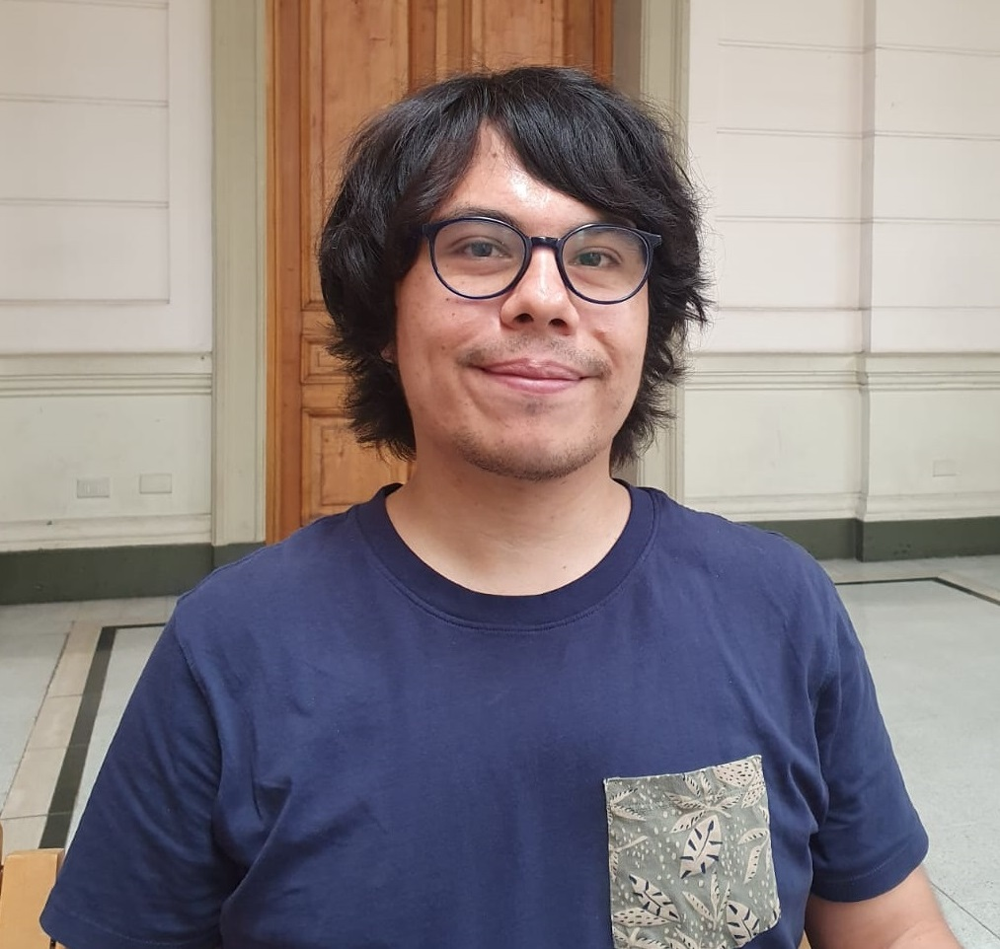

# Hi there 👌 I'm Gabriel Iturra-Bocaz

 

## Biography

Hello!

I am Gabriel, holding a Master's degree in Computer Science from the Department of Computer Science at the University of Chile. My thesis focused on the study and implementation of incremental text representation under the supervision of Professor [Felipe Bravo-Marquez](https://felipebravom.com).

Currently, I am an active member of the ReLeLa research group at DCC UChile. My research interests encompass Incremental Learning, Natural Language Processing, and Data Streams.

Beyond my research pursuits, I find joy in teaching. During my leisure time, I engage in physical exercise and indulge my curiosity by exploring new subjects through books and videos.

## Research Areas

I specialize in the extraction of knowledge and information from unstructured data, with a focus on natural language text and streaming learning. My research interests encompass several interrelated fields in this domain.

* [Natural Language Processing](https://en.wikipedia.org/wiki/Natural_language_processing)
* [Data Stream Mining](https://en.wikipedia.org/wiki/Data_stream_mining)
* [Machine Learning](https://en.wikipedia.org/wiki/Machine_learning)
* [Artificial Intelligence](https://en.wikipedia.org/wiki/Artificial_intelligence)

## Contact

*  Address: Department of Computer Science - University of Chile. 
*  Email : gabrieliturrab at ug.uchile.cl

## Other Profiles

* [Google Scholar](https://scholar.google.com/citations?user=emd1wQkAAAAJ&hl=es)
* [Orcid](https://orcid.org/my-orcid?orcid=0009-0001-9635-0683)
* [ResearchGate](https://www.researchgate.net/profile/Gabriel-Iturra-Bocaz)
* [Semantic Scholar](https://www.semanticscholar.org/author/Gabriel-Iturrra/32830698)
* [GitHub](https://github.com/giturra)
* [IMFD](https://imfd.cl/investigador/gabriel-iturra/)
* [Twitter](https://twitter.com/g_iturrab)
* [LinkedIn](https://www.linkedin.com/in/giturra/)

Last Updated May 27th, 2023
