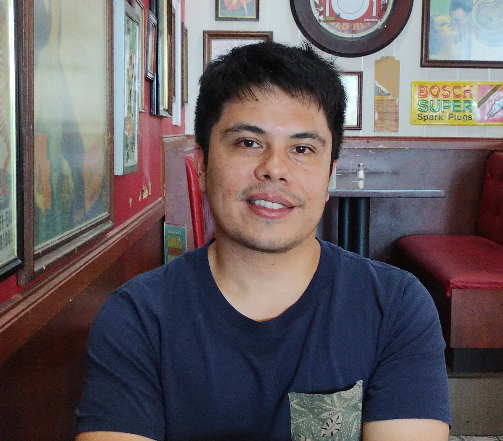

# Hi there 👌 I'm Gabriel Iturra-Bocaz

 

## Biography

Hello!

I am Gabriel, and I hold a Master's degree in Computer Science from the [Department of Computer Science](https://www.dcc.uchile.cl/) at the University of Chile. My thesis focused on the study and implementation of incremental text representations under the supervision of Professor [Felipe Bravo-Marquez](https://felipebravom.com).

Currently, I am working as a Machine Learning Engineer at [Replai SpA](https://replai.cl/about), a Chilean startup that seeks to revolutionize the way meta-search engines work in specific domains, including law and healthcare. 

My research interests encompass Reinforcement Learning, Large Language Models and Natural Language Processing. In my leisure time, I engage in physical exercise, especially biking, and I satisfy my curiosity by exploring new subjects through books and videos

## Research Areas

I specialize in the extraction of knowledge and information from unstructured data, with a focus on natural language text and streaming learning. My research interests encompass several interrelated fields in this domain.

* [Reinforcement Learning](https://en.wikipedia.org/wiki/Reinforcement_learning)
* [Information Retrieval](https://en.wikipedia.org/wiki/Information_retrieval)
* [Large Language Models](https://en.wikipedia.org/wiki/Large_language_model)
* [Natural Language Processing](https://en.wikipedia.org/wiki/Natural_language_processing)
* [Machine Learning](https://en.wikipedia.org/wiki/Machine_learning)
* [Artificial Intelligence](https://en.wikipedia.org/wiki/Artificial_intelligence)

## Contact

* Personal email: g.iturra.bocaz at gmail.com
* Work email: gabriel at replai.cl

## Other Profiles

* [Google Scholar](https://scholar.google.com/citations?user=emd1wQkAAAAJ&hl=es)
* [Orcid](https://orcid.org/my-orcid?orcid=0009-0001-9635-0683)
* [ResearchGate](https://www.researchgate.net/profile/Gabriel-Iturra-Bocaz)
* [Semantic Scholar](https://www.semanticscholar.org/author/Gabriel-Iturrra/32830698)
* [GitHub](https://github.com/giturra)
* [IMFD](https://imfd.cl/investigador/gabriel-iturra/)
* [X](https://x.com/g_iturrab)
* [LinkedIn](https://www.linkedin.com/in/giturra/)

Last Updated April 6, 2024.
